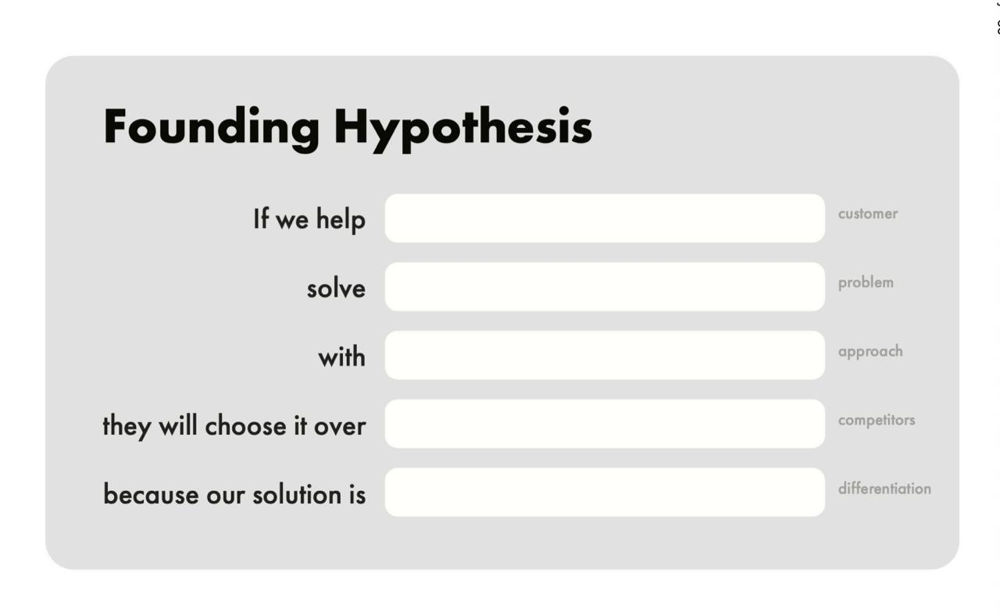

# Book: *Click* (theclickbook.com)

Source: https://www.theclickbook.com

Authors: Jake Knapp, John Zeratsky

## What it is (context)

*Click* is a new book/sprint method from the author of *Sprint*.
It introduces the **Foundation Sprint**: a 2-day sprint designed to set up a big project.

From the site:
- Day 1 (morning): define the basics of the project
- Day 1 (afternoon): craft differentiation
- Day 2: evaluate multiple options and choose an approach
- Output: a **Founding Hypothesis** — a clear statement of what you believe that can be proved (or disproved) with Design Sprints

## Founding Hypothesis (visual)

## The hypothesis to set up in the Foundation Sprint

Goal: produce a **Founding Hypothesis** that is specific enough to test and strong enough to align the team.

A good Founding Hypothesis typically includes:

1) **Target customer / user**
- Who is this for?
- What situation are they in?

2) **Problem / job-to-be-done**
- What pain/problem are we solving?
- What’s the current workaround?

3) **Proposed solution / approach**
- What are we going to build/do (at a high level)?

4) **Differentiation / why we’ll win**
- Why will this stand out vs alternatives?
- What unique advantage do we have?

5) **Success criteria (measurable)**
- What observable outcome would prove we’re right?
- What would falsify it?

6) **Risks / assumptions to test first**
- Which assumptions are the most uncertain + most important?

### Template (copy/paste)

> **We believe** [target customer] who [context/situation] will choose [our solution/approach] because [differentiation].
> 
> **This will succeed if** [measurable outcomes].
> 
> **We’ll know we’re wrong if** [clear falsifier].
> 
> **The riskiest assumptions are** [A], [B], [C].

## Notes / questions

- What project do I want to run a Foundation Sprint for?
- Who should be in the room (decision maker, domain expert, design/eng, GTM)?
- What’s the first Design Sprint we’d run to test the riskiest assumption?
