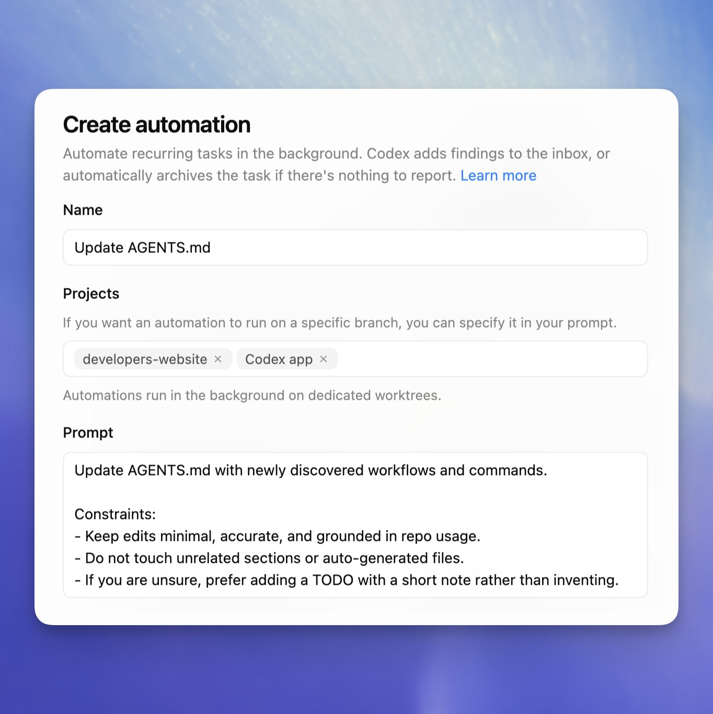
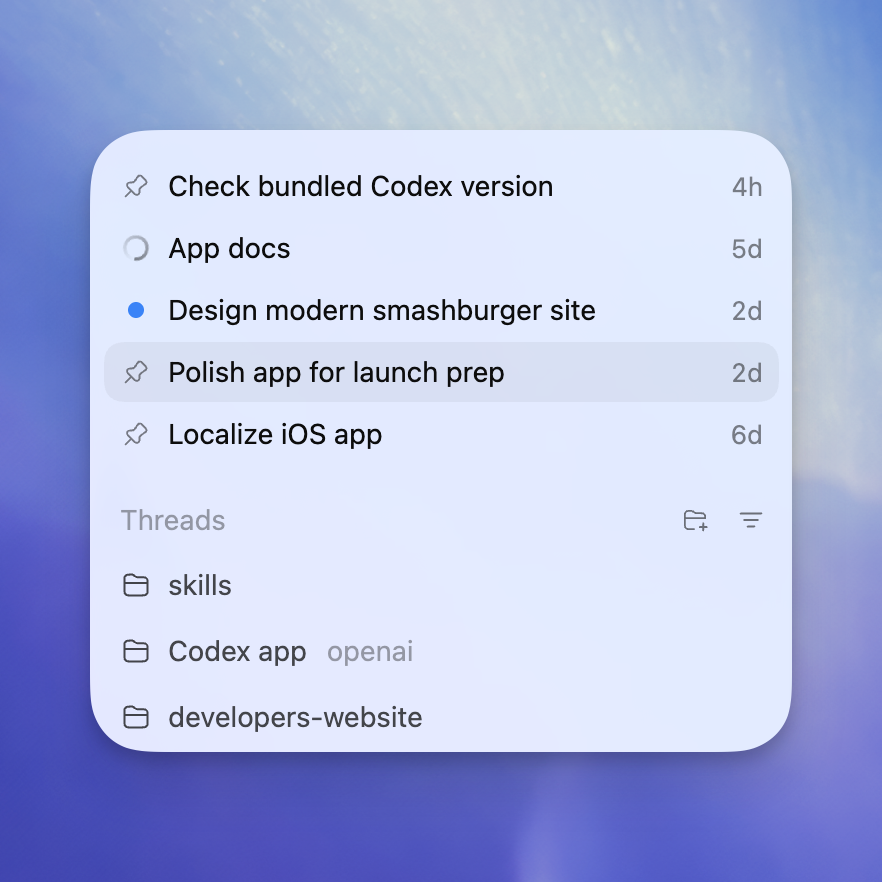
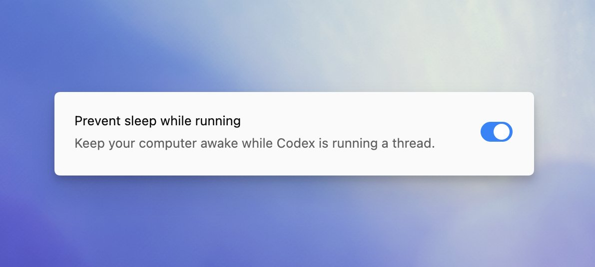
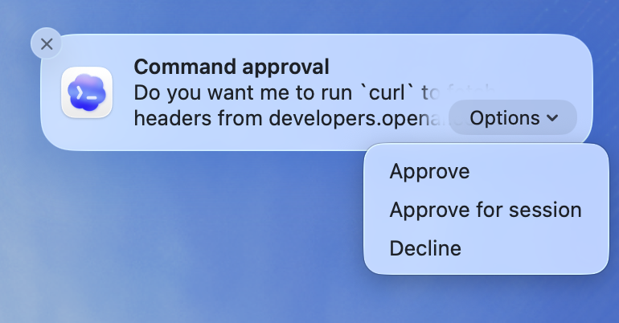
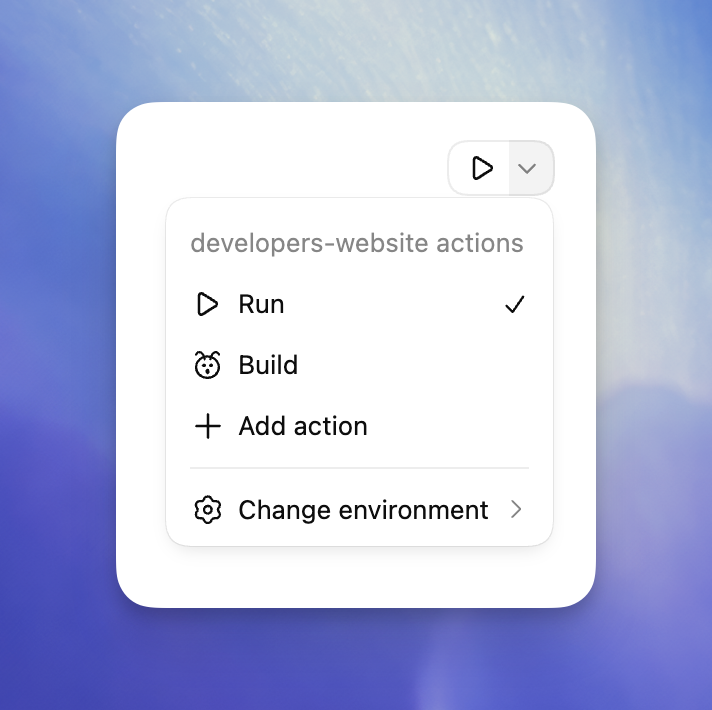
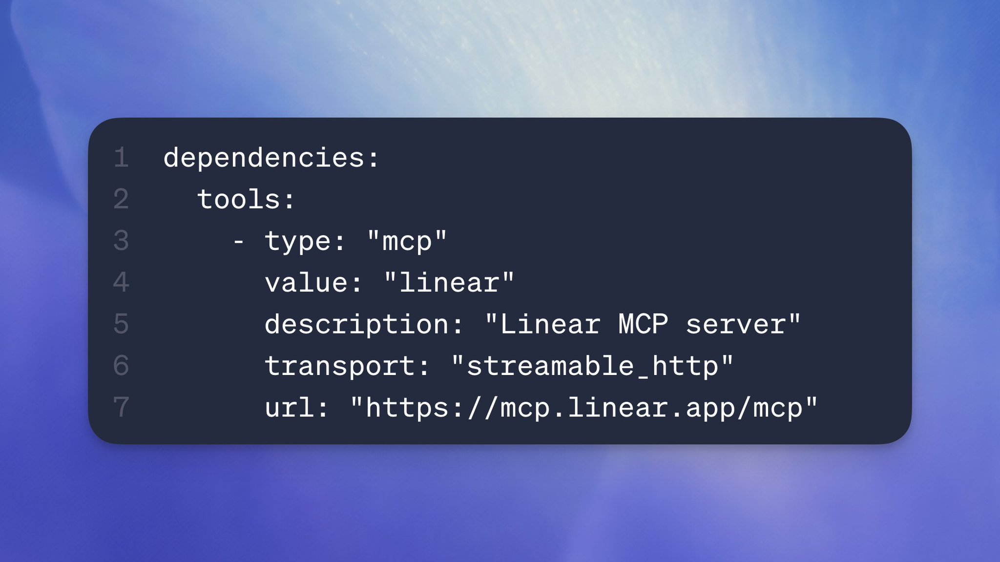
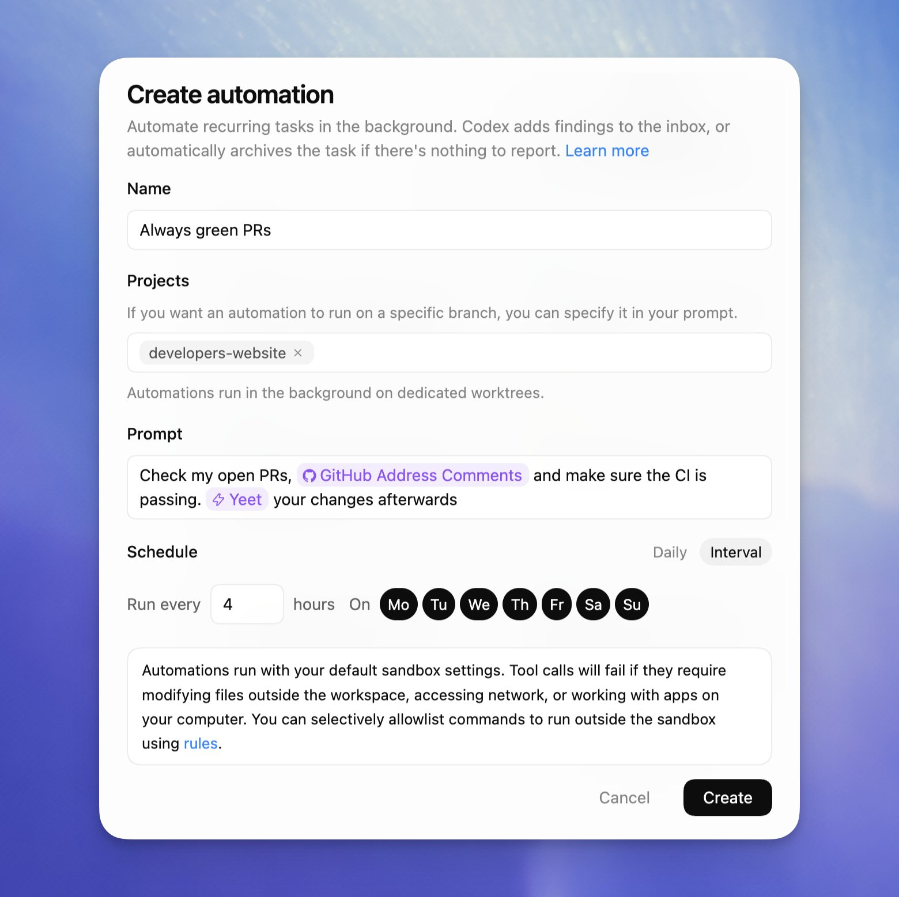
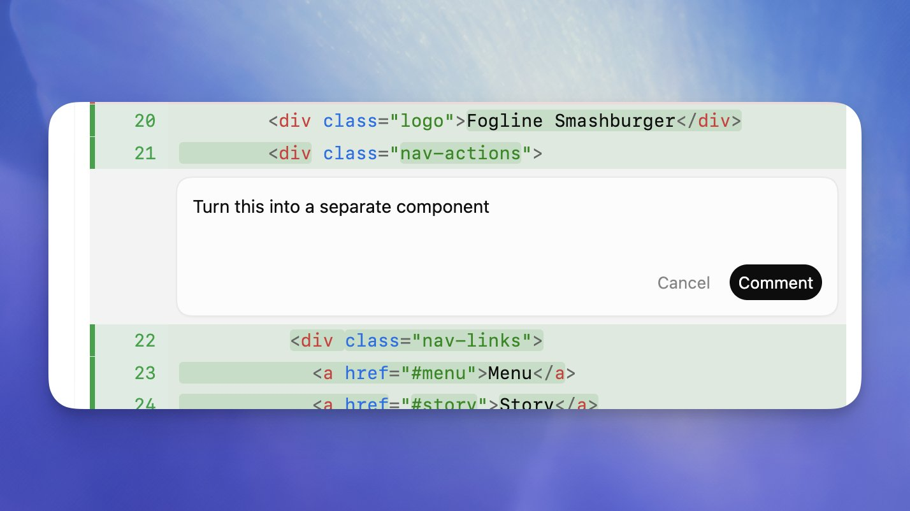

## TL;DR

If you want to work mostly inside the Codex app: invest in **self-improving setup** (daily tasks that update your AGENTS/skills), use **pinned threads** to juggle projects, keep the machine **awake**, enable **notifications** for approvals/completions, define **environment actions** (start dev server/build), rely heavily on **skills + MCP**, automate the boring (PRs/issues), and give feedback via **inline comments** in the review panel.

## Key takeaways (from the thread)

- **Make Codex improve itself**: schedule a daily task to review past sessions and update `~/.codex/sessions`-based knowledge, your `AGENTS.md`, and/or skills.
- **Use pinned threads** to keep multiple workstreams visible when multitasking.
- **Prevent sleep** so long-running tasks continue even if your Mac would lock.
- **Turn on Codex notifications** for approval requests + completions while it runs in the background.
- **Define actions in local environments** (one-click start dev server / build in the integrated terminal).
- **Lean on Skills + MCP** (and share skills in the repo with your team).
- **Automate boring work**: have Codex periodically check PRs/issues, fix CI, and push updates.
- **Use inline comments** in the review panel for precise, line-level feedback on generated output.

---

## The tips, expanded

### 1) Have Codex “automatically become better”

Dominik recommends adding a recurring daily task that reads your past sessions (e.g. `~/.codex/sessions`) and uses that to update your operating docs and reusable workflows:

- update `AGENTS.md`
- update or create new **skills** for common tasks

Thread post: https://x.com/dkundel/status/2018455599391121851

### 2) Use pinned threads

Pinned threads are a lightweight way to track what’s in progress across multiple projects.

Thread post: https://x.com/dkundel/status/2018455601370857724

### 3) Prevent sleeping

If your Mac locks/sleeps, long-running Codex tasks can stall. Adjust system settings to keep it awake while you want Codex to churn.

Thread post: https://x.com/dkundel/status/2018455603056877874

### 4) Notifications

Enable Codex app notifications so you can respond quickly to:
- approval requests
- “turn completed” notifications

…without switching back into the app foreground.

Thread post: https://x.com/dkundel/status/2018455604650725448

### 5) Actions in local environments

Configure “actions” in your environment settings for frequent tasks:
- start dev server
- run build

They run in the integrated terminal, and can be launched with a button.

Thread post: https://x.com/dkundel/status/2018455606454370532

### 6) Skills + MCP

Skills (especially when checked into the project repo) are framed as the biggest force multiplier:
- standardize workflows
- share with your team
- encode how to do recurring project tasks

Thread post: https://x.com/dkundel/status/2018455608769544316

### 7) Automations for boring work

Have Codex run periodically (e.g. hourly) to:
- check PRs
- address comments
- fix CI failures
- push changes back to the PR

Thread post: https://x.com/dkundel/status/2018455610610893302

### 8) Use inline comments for specific feedback

Dominik calls out the review panel as a major reason he rarely uses an IDE: inline comments let you give precise feedback on generated output, speeding up edits and keeping intent aligned.

Thread post: https://x.com/dkundel/status/2018455612431196340

---

## Figures (from the thread)

Local copies are stored under `topics/agentic_coding/assets/dkundel_codex_app_tips/`.

1. **Daily task → update sessions / AGENTS / skills**
   - local: 
   - source: https://pbs.twimg.com/media/HAL9uZ9aMAA7sIo?format=jpg&name=900x900

2. **Pinned threads**
   - local: 
   - source: https://pbs.twimg.com/media/HAL9zvyagAAf-JH?format=png&name=900x900

3. **Prevent sleeping**
   - local: 
   - source: https://pbs.twimg.com/media/HAL98JSbgAA-LrX?format=jpg&name=medium

4. **Notifications**
   - local: 
   - source: https://pbs.twimg.com/media/HAL-AA4bAAAoBx3?format=png&name=900x900

5. **Actions in local environments**
   - local: 
   - source: https://pbs.twimg.com/media/HAL-GEMbgAEEp0y?format=png&name=900x900

6. **Skills + MCP**
   - local: 
   - source: https://pbs.twimg.com/media/HAL-RDbbsAA9agp?format=jpg&name=medium

7. **Automations for boring work**
   - local: 
   - source: https://pbs.twimg.com/media/HAL-XY0aUAAF9qA?format=jpg&name=900x900

8. **Inline comments in review**
   - local: 
   - source: https://pbs.twimg.com/media/HAL-bhpagAAU-qQ?format=jpg&name=medium
