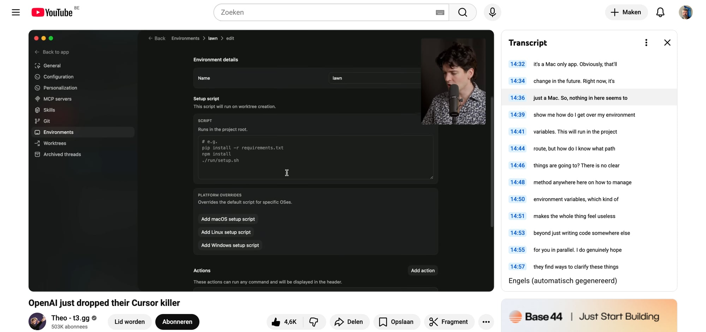

## TL;DR

Theo’s take: the Codex app is a **UI/orchestration layer** on top of the Codex CLI that makes it much easier to run **multiple parallel work threads across projects**, with **git-integrated workflows** (commit/push/PR), **worktrees**, an integrated **terminal**, **environments** (setup scripts + env vars), and scheduled **automations**. It changes the feel from “chat in an IDE” to “manage a fleet of agent tasks”.

## What’s new (concepts & primitives in the Codex app)

### 1) Threads (the main unit of work)

- The app is built around **threads**: long-running units of work that you can jump between while agents run.
- The point is **parallelization**: start something that takes time, then switch to another thread/project.

Transcript hints:
- “manage … threads … within [projects]” (~04:20)
- “across many threads inside of this app” (~06:11)
- “hopping between different threads” (~08:25)

### 2) Worktrees (parallel branches without context chaos)

He discusses work that needs to happen on multiple changes in the same repo and why keeping branches in sync is painful; the app leans on **worktrees** to make parallel work sane.

(Transcript in this UI didn’t match the keyword “worktree” in the extracted hits, but the app sidebar and his discussion indicate worktree-centric workflow.)

### 3) Git-native workflows: commit / push / PR

Codex app adds first-class buttons/flows for:
- viewing a diff
- committing
- **commit + push**
- **commit + create PR**

Transcript snippets:
- “little button up here, commit” (~07:39)
- “commit and push or commit and create PR” (~08:13)

### 4) Diff panel + “open in editor”

Instead of living inside a single IDE, the app can:
- show a diff panel
- let you **open in VS Code** (or another editor) to inspect changes

Transcript snippets:
- “code diff panel button” (~07:41)

### 5) Integrated terminal (less tab-juggling)

The app includes a built-in terminal per project so you don’t lose track of terminal tabs when juggling multiple tasks.

Transcript snippets:
- “They also have a terminal on the bottom …” (~07:55)

### 6) Environments (setup scripts + env vars + reproducible context)

A key concept: an **Environment** per project that can encode:
- a name
- a **setup script** (run on worktree creation / in project root)
- environment variables

This is essentially: “make the agent’s runtime explicit and reproducible.”

Transcript snippets:
- “spin up a dev environment or manage environment variables” (~13:34)
- “environment has a name. It has a setup …” (~14:26)

Figure (screenshot from this session):

### 7) Skills browser + MCP servers

He calls out:
- an in-app **skills browser**
- integration points for **MCP**

Transcript snippets:
- “pretty cool skills browser” (~15:11)
- “There’s also MCP” (~15:07)

### 8) “Yeet” (a packaged workflow skill)

A memorable example of a workflow skill: **yeet**.

- Described as: stage → commit → open PR.
- The point is turning a multi-step Git workflow into a single, reusable action.

Transcript snippets:
- “personal favorite, yeet, which will stage, commit, and open a PR” (~15:42–15:44)

### 9) Automations (scheduled agent work)

He frames automations as a way to outsource background chores.

- Automations run on a schedule.
- Can target one or multiple projects.
- They create a thread with results (and he mentions automatic thread creation).

Transcript snippets:
- “talk about automations” (~18:30)
- “Automations are kind of like …” (~18:38)
- “automatic thread creation …” (~19:50)

## Mental model

- **IDE agent tools** (Cursor/Claude Code/etc.) optimize “edit code while chatting”.
- Codex app optimizes “**run and supervise multiple agent jobs**” across projects, with git, environments, and automation as first-class primitives.

## Source

YouTube: https://www.youtube.com/watch?v=qKf9sgKFQLU
